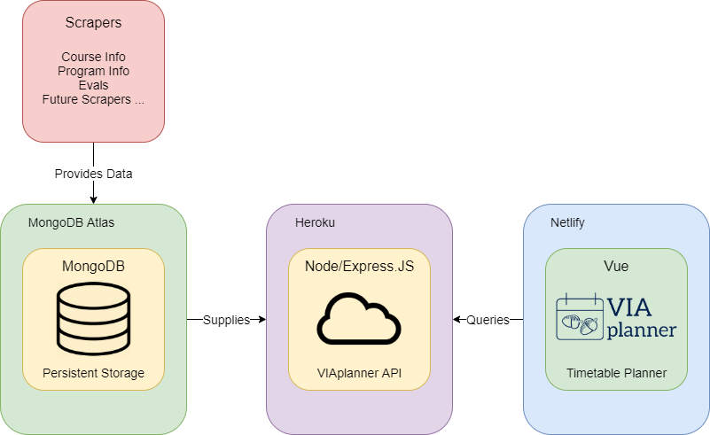

## API Overview

Welcome to the VIAplanner API. The API is written with Express to provide maximum efficiency and coding experience. The purpose of this API is to supply the data needed for our timetable planner.

**Notes:**

1. The API is limited to **only** VIAplanner developers. Thus, an API key is required. The reason for doing so is to maximize performance for our timetable planner
2. Currently, the API only contains UTM data. However, we will expand it in the future to house UTSG and UTSC data as well
3. The API is still under development. Thus, the routes are likely to change
4. If you wish to use this API, please contact us at our [GitHub](https://github.com/UTM-Hacklab/VIAplanner)

## High-level overview


## Query Guide

### Base URL
https://api.viaplanner.ca (this will take you to the docs)

### Get all courses
**method:** get <br/>
**usage:** https://api.viaplanner.ca/courses?api_key=api_key <br/>
**schema:** see [**Data Structure 9**](#_9-all-courses) <br/>
**return value:**
- success: an array containing objects of all courses in the data base
- failure: an object with the fail message 

### Get a courses
**method:** get <br/>
**usage:** https://api.viaplanner.ca/courses/courseCode?api_key=api_key <br/>
**schema:** see [**Data Structures 1-3**](#_1-course) <br/>
**return value:** 
- success: an object containing the data of the specified course
- failure: an object with the fail message 

### Get the search bar value 
**method:** get <br/>
**usage:** https://api.viaplanner.ca/courses/searchbar?api_key=api_key <br/>
**schema:** see [**Data Structure 8**](#_8-course-search-bar) <br/>
**return value:** 
- success: an array containing objects with the courseCode and name of every course in the database 
- failure: an object with the fail message 

### Create a courses
**method:** post <br/>
**usage:** https://api.viaplanner.ca/courses?api_key=api_key <br/>
**schema:** see [**Data Structures 1-3**](#_1-course) <br/>
**return value:** 
- success: an object with a message saying the course was created
- failure: an object with the fail message 


## Data Sources

### 1. [UTM Timetable:](https://student.utm.utoronto.ca/timetable/)

**Data Provided:** Information regarding every course in UTM. Information such as lecture time, professors, pre-requisite etc are provided (refer to [**Data Structures 1-3**](#_1-course) for details).

### 2. [UTM Academic Calendar:](https://student.utm.utoronto.ca/calendar/program_list.pl)

**Data Provided:** Information regarding every program in UTM. Information such as post requirement, required courses, program level (minor, major, specialist) etc are provided (refer to [**Data Structures 4-5**](#_4-subject) for details).

### 3. [UTM Program Selection Guide:](https://www.utm.utoronto.ca/registrar/office-registrar-publications/program-selection-guide)

**Data Provided:** Program type (1, 2, 3) for every UTM program. This information is stored as a attribute in [**Data Structures 5, Program**](#_5-program).

### 4. [UTM Course Evaluations:](https://course-evals.utoronto.ca/BPI/fbview.aspx?blockid=hjeZ7JJWJupVgjPoyu&userid=tO4GQugFiFULB0AXgInh7idHCU-AnN3pNhvC&lng=en)

**Data Provided:** Course evaluation results for UTM Mississauga Undergraduate Programs (refer to [**Data Structure 6**](#_6-course-evaluation)).

## Scraper Breakdown

### 1. UTM Course Scraper:

The scraper takes data from [**Data Source, UTM Timetable**](#_1-utm-timetable) loads all course data (since they generated with Javascript) with puppeteer. (refer to [**Data Structures 1-3**](#_1-course) for details).

### 2. UTM Program Scraper:

The scraper takes data from [**Data Source, UTM Academic Calendar**](#_2-utm-academic-calendar) then the data are placed into 2 objects (refer to [**Data Structures 4-5**](#_4-subject) for details). The data is used for the course guide API to provide recommended courses.

### 3. Course Evaluation Scraper

The scraper takes data from [**Data Source, UTM Course Evaluations**](#_4-utm-course-evaluations).

Items 1-9 are criteria with responses that range from 1 to 5, with 1 as the lowest rating and 5 as the highest rating.

-   **item 1:** I found the course intellectually stimulating.
-   **item 2:** The course provided me with a deeper understanding of the subject matter.
-   **item 3:** The instructor created a course atmosphere that was conducive to my learning.
-   **item 4:** Course projects, assignments, tests and/or exams improved my understanding of the course material.
-   **item 5:** Course projects, assignments, tests and/or exams provided opportunity for me to demonstrate an understanding of the course material.
-   **item 6:** Overall, the quality of my learning experience in this course was: (Scale for Item 6: Poor, Fair, Good, Very Good, Excellent).
-   **item 7:** Course Workload.
-   **item 8:** I would recommend this course.
-   **item 9:** I inspired to learn subject matter.

## Data Structures

### 1. Course

```js
type Course
{
        id: String,
        courseCode: String,
        name: String,
        description: String,
        division: String,
        department: String,
        prerequisites: String,
        exclusions: String,
        level: Int,
        campus: String,
        term: String,
        breadths: [Int],
        meeting_sections: [MeetingSection]
}
```

### 2. Meeting Section

```js
type MeetingSection
{
        sectionCode: String,
        instructors: [String],
        times: [Times],
        size: Int,
        enrolment: Int,
        notes: String
}
```

### 3. Time

```js
type Times
{
        day: String,
        start: Int,
        end: Int,
        duration: Int,
        location: String
}
```

### 4. Subject

```js
type Subject
{
        name: String,
        degrees: [String],
        notes: [String],
        programs: [Program]
}
```

### 5. Program

```js
type Program
{
         name: String,
         level: String,
         code: String,
         type: String,
         notes: [String]!,
         courses: YearCourses
}
```

### 6. YearCourses

```js
type YearCourses
{
         year1: [String],
         year2: [String],
         year3: [String],
         year4: [String]

}
```

### 7. Course Evaluation

```js
{
   "department":String,
   "course":String,
   "Prof":[String],
   "term":int,
   "item 1":float,
   "item 2":float,
   "item 3":float,
   "item 4":float,
   "item 5":float,
   "item 6":float,
   "item 7":string,
   "item 8":string,
   "item 9":float,
}
```

### 8. Course search bar

```js
[
    {
        courseCode: String,
        name: String
    }
]
```

### 9. All courses

```js
[
    Course
]
```

