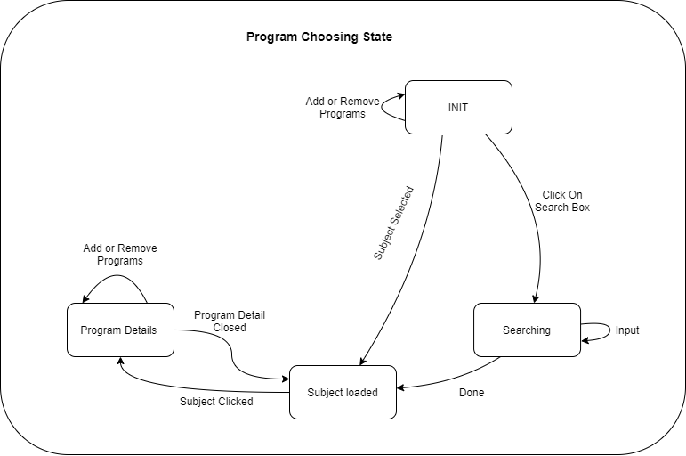
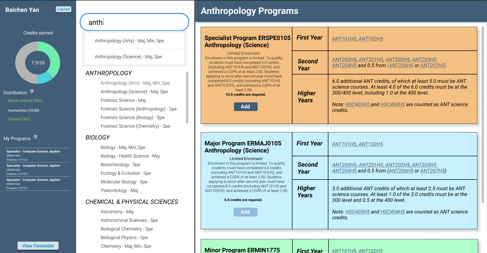
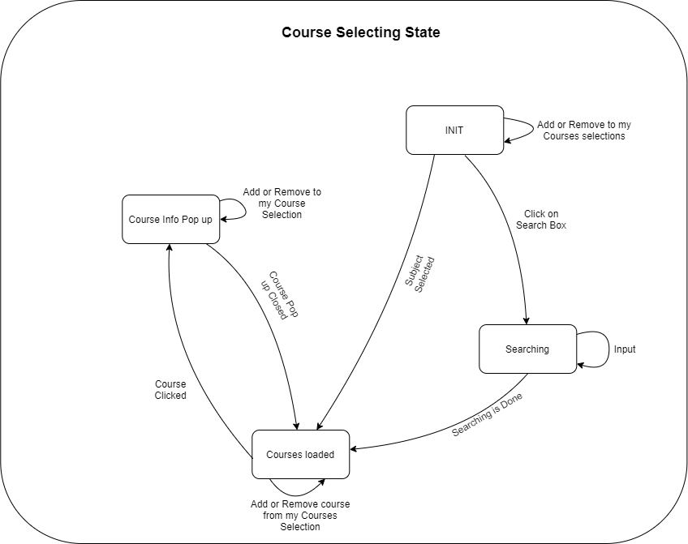
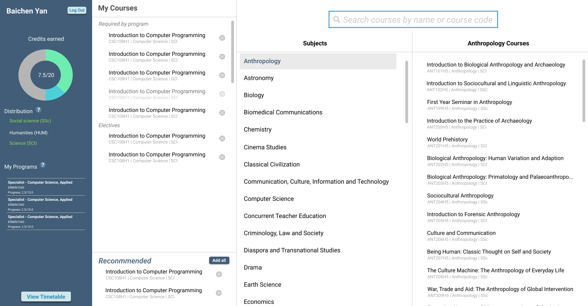

# Course Guide

## Vision
The Course Guide component helps students have a better understanding of what the right courses for them are.

The Course Guide generates a list of recommend courses based on the student's year and programs from students.

## Overview

The course guide covers the program and course selection of the user's journey through our system. 


### Program Selection

After a user selects their year, they're able to browse through the list of programs available to them, adding programs to their program cart as they see fit. 

__User Journey Statechart__


__Program Selection Concept Design__


### Course Selection

With the programs selected, the user now moves to the course selection stage. Here, the user can add courses to their course cart by exploring courses via the search bar or consulting our _Recommended Courses_ UI component's suggestions. 

__User Journey Statechart__
 

__Course Selection Concept Design__



## Terminology

### Program
Contains all the information for a program, refer to [Course API](https://uoftcoursetools.tech/course-api/)

### Subject
Contains an array of Programs, ex: Anthropology contains Specialist Program ERSPE0105
Anthropology (Science), Major Program ERMAJ0105 Anthropology (Science), and Minor Program ERMIN1775
Anthropology (Arts).

### Subject Group
Contains an array of Subjects, subjects are grouped into bigger groups, like the field of study. Ex: Biology is a SubjectGroup that contains Biology, Biology-Health Science, Biotechnology, Ecology & Evolution, Molecular Biology and Paleontology.

### Course
Contains all the information for a course, refer to [Course API](https://uoftcoursetools.tech/course-api/)

### CourseGroup
Contains a group of Courses. Courses are grouped according to their course codes, ex: all the courses that start with "CSC" are under the Computer Science group


## Component Breakdowns

The course guide involves the most UI interaction with the user, thus it is important to keep track of the abstract design. 


## Part 1: Program Choosing

### MyProgramsList

The list of programs the user has added. 

```js
MyProgramsList{
    data:{
        programs: [Program]//array of programs the user has added
    },
    methods:{
        deleteProgram(program) // triggered when pressing delete on a program
    },
    components:{
        [ChosenProgramTile] //each tile is a program in the list and is clickable
    }
}
```

### ChosenProgramTile

The component for the programs listed in MyprogramsList

```js
ChosenProgramTile{
    data: {
        programName: String //The name of the program this tile represents
        subject: Subject //which subject this program belongs in
    },
    methods: {
        loadSubject(subject), /*displays the programs in the same subject as 
        selected_program in the "programCardsPanel",*/
        delete() //remove this program when the "x" button is clicked
    },
    components: {
        DeleteButton
    }
}
```

### SubjectsList

The SubjectsList is a list of all the subject names offered at UTM. The user can browse through it and click a subject in this list to view all the programs of that subject.

```js
SubjectsList{
    data:{
        searchMatchingSubjects: [Subject] /*The subjects that have a program that 
                                            matches the search query*/
        showingGroups: [SubjectGroup] //array of subject groups that still shows in this list
    },
    components:{
        [SubjectTile]: //an array of subject names that can be clicked
    }
}
```

### SubjectTile

The component for the subjects in SubjectsList

```js
SubjectTile{
    data: {
        subject: Subject, //the subject this tile represents
        highlighted: boolean
    },
    methods: {
        loadSubject(subject) /*displays the programs in the same subject as 
                               selected_program in the "programCardsPanel",*/
    }
}
```

### ProgramCardsPanel

The component that displays the detailed information of each program in a subject and allows the user to add a program to My_Programs_List

```js
ProgramCardsPanel {
    data: {
        subject: Subject //The subject 
    },
    methods:{
        setSubject(subject) //Save the specified subject into data.subject to load programCards
    },
    components:{
        [ProgramCard] //each individual program's information 
    }
}
```

### ProgramCard

The ProgramCard displays all the information about a specific program, and a button to add it

```js
ProgramCard {
    data:{
        program: Program //The program this card represents
    },
    methods: {
        /*The required courses string for a certain year contains course codes
        that refer to a course, we need a regex to recognize the course code pattern and transform
        each of them into a CourseLink component that can be clicked to pop up a course info frame.*/
    },
    components:{
        AddProgramButton, //The "Add" button
        [CourseLink] //each mention of a course code under required courses is a CourseLink
    }
}
```

### CourseLink

The course code of a course, clicking on it opens CourseInfoPopup

```js
CourseLink {
    data:{
        course: Course //The course this component links to
    },
    methods: {
        openPopup() //Triggered when this component is clicked, create a new instance of the pop up frame
    }
}
```

### ProgramSearchBar

The user can search for a program by NAME

The search results are shown by the shortening of the SubjectsList

Only the groups of subjects that contain at least one subject that contains at least 
one program that matches the search query will remain in the SubjectsList

The subjects that contain at least one program that matches the search query will be highlighted
for the user to see and click into

The search can only be canceled by clearing the search box, in which case the SubjectsList will 
be restored in full

```js
ProgramSearchBar{
    data:{
        query: String, //The current search query
    },
    methods:{
        search(query) /*Calls search for query in back-end and updates SubjectsList.showingGroups
                        and SubjectsList.searchMatchingSubjects
                        Better emit an event up to the main application to call a methods that does 
                        all that*/
    },
}
```

## Part 2: Course Choosing

### CourseGroupsList

The list of all the groups of courses offered at UTM, ex: Anthropology, Astronomy

```js
CourseGroupsList{
    data: {
        groups: [CourseGroup], //Array of all the courseGroups
        expandedGroup: CourseGroup /*The selected course group is highlighted and expanded
                                    in the CourseList*/
    },
    components:{
        [CourseGroupTile] //An array of course group names that can be clicked 
    }
}
```
### CourseGroupTile

The component for a single course group in CourseGroupsList

```js
CourseGroupTile{
    data: {
        groupName: String //The name of the course group this tile represents
        highlighted: Boolean
    },
    methods: {
        loadCourseGroup() /*load the courses in this group into the course list by
                            passing in the groupName*/
    }
}
```

### CourseList

The list shows all the courses in a specific course group, all the courses in one group has
course codes that start with the same 3 letters, ex: CSC, MAT

```js
CourseList {
    data: {
        courses: CourseGroup //The courses in this list
    },
    methods: {
        loadCourses(groupName) //Searches the backend for the CourseGroup with the given groupName
    },
    components: {
        [CourseTile] //Each tile represents a course
    }
}
```

### CourseTile

The component for a single course in MyCoursesList, RecommendedList, and CourseList

```js
CourseTile {
    data: {
        course: Course, //The course this tile represents
        state: int /* What is the parent of this tile,
                    CourseList: has no extra buttons
                    MyCoursesList: has delete button while hovering
                    RecommendedList: has add button while hovering*/
    },
    methods: {
        courseClicked(), //pop up course info  frame
        deleteCourse(), //If delete button is clicked, remove this course from MyCoursesList
        addCourse(), /*If add button is clicked, add this course to My CoursesList and Remove 
                       it from RecommendedList*/
    },
    components: {
        //Depending on the state
        AddCourseButton,
        DeleteCourseButton
    }
}
```

### MyCoursesList

The list of courses the user has selected for this year

```js
MyCoursesList {
    data: {
        myCourses: [Course], //The courses the user has added
    },
    methods: {
        addCourse(Course), //Adds the specified course to myCourses
        removeCourse(Course), //Removes the specified course from myCourses
    },
    components: {
        [CourseTile]
    }
}
```

### RecommendedList

The list of courses recommended to the user based on their year of study and their 
chosen program(s)

```js
RecommendedList {
    data: {
        recommendedCourses: [Course], //Array of recommended courses
    },
    methods: {
        loadRecommendedCourses() /*Looks at the year of study, selected program(s), and 
                                   what's already in MyProgramsList to determine a list of 
                                   recommended courses*/
        removeCourses(Course), /*Removes the specified course from recommendedCourses (when
                                 the user adds it)*/
    },
    components: {
        [CourseTile], 
        AddAllButton //There is a button for adding all of the courses in this list at once
    }
}
```

### CourseInfoPopUp

The pop-up frame what pops up whenever a course is clicked for detailed information

```js
CourseInfoPopup {
    data: {
        added: Boolean //Whether this course in my MyCoursesList
        course: Course //The course which this pop-up frame is displaying info for
    },
    methods: {
        addCourse(), //Adds this course to MyCoursesList
        removeCourse(), //Removes this course from MyCoursesList
    },
    components: {
        CourseLinks, //references to other courses, click to open another pop-up
        AddCourseButton, //Depending on added state
        RemoveCourseButton, //Depending on added state
        ExitButton, //To close the pop-up
    }
}
```

### CourseSearchBar

The search bar allows the user to search for a course by the COURSE CODE.

The search results are in a drop-down frame under the search bar, the drop-
down frame has a limited size, any overflowing search results can be viewed
by scrolling in the drop-down frame.

The search results are also CourseTile Components that can be clicked to 
pop-up a course info frame

The search can be canceled by clicking elsewhere outside the search bar

```js
CourseSearchBar {
    data: {
        query: String, //The current search query   
        results: [Course] //The courses that match the search query
    },
    methods: {
        search(query), /*Searches the back end for courses with course codes that 
                        match the query and updates results*/
        clear() //Clears the search box and results drop down if search is canceled
    },
    components: {
        [CourseTile] //CourseTile components each as a search result in the drop-down
    }
}
```